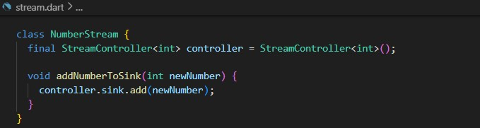
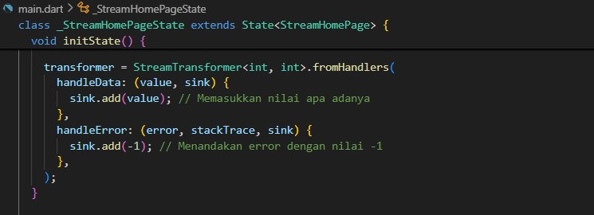
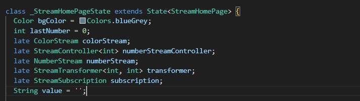

# stream_tyase

Nama: Tyase Nisa'an Jamilaa

Absen: 26

Kelas: 3H

---

## Praktikum 1: Dart Streams

### Langkah 1: Buat Project Baru

### Langkah 2: Buka file main.dart

**Soal 1**

- Tambahkan nama panggilan Anda pada title app sebagai identitas hasil pekerjaan Anda.
- Gantilah warna tema aplikasi sesuai kesukaan Anda.
- Lakukan commit hasil jawaban Soal 1 dengan pesan "W12: Jawaban Soal 1"

### Buat file baru stream.dart

### Langkah 4: Tambah variabel colors

**Soal 2**

- Tambahkan 5 warna lainnya sesuai keinginan Anda pada variabel colors tersebut.
- Lakukan commit hasil jawaban Soal 2 dengan pesan "W12: Jawaban Soal 2"

### Langkah 5: Tambah method getColors()

### Langkah 6: Tambah perintah yield\*

**Soal 3**

- Jelaskan fungsi keyword yield\* pada kode tersebut!

  yield* digunakan untuk meneruskan elemen-elemen dari stream atau iterable lain ke dalam stream utama. Dalam kode tersebut, yield* mengalirkan data dari Stream.periodic ke dalam stream getColors.

- Apa maksud isi perintah kode tersebut?

  Kode menghasilkan stream warna setiap detik dengan menggunakan Stream.periodic. Indeks warna dihitung menggunakan t % colors.length agar warna terus berulang jika sudah mencapai akhir daftar.

- Lakukan commit hasil jawaban Soal 3 dengan pesan "W12: Jawaban Soal 3"

### Langkah 7: Buka main.dart

### Langkah 8: Tambah variabel

### Langkah 9: Tambah method changeColor()

### Langkah 10: Lakukan override initState()

### Langkah 11: Ubah isi Scaffold()

### Run

**Soal 4**

- Capture hasil praktikum Anda berupa GIF dan lampirkan di README.
- Lakukan commit hasil jawaban Soal 4 dengan pesan "W12: Jawaban Soal 4"

### Langkah 13: Ganti isi method changeColor()

**Soal 5**

- Jelaskan perbedaan menggunakan listen dan await for (langkah 9) !

  await for digunakan dalam fungsi async untuk menangani stream dengan cara yang lebih sederhana dan mudah dibaca. Ia secara otomatis menunggu dan mengambil event stream satu per satu tanpa memerlukan callback tambahan.

  Sedangkan listen() memberikan kontrol lebih besar terhadap stream, memungkinkan Anda untuk menangani event, error, dan menyelesaikan stream dengan menggunakan parameter tambahan seperti onError dan onDone. listen() lebih fleksibel dan bisa digunakan di luar fungsi async, namun membutuhkan callback untuk setiap event yang diterima.

- Lakukan commit hasil jawaban Soal 5 dengan pesan "W12: Jawaban Soal 5"

---

## Praktikum 2: Stream Controllers dan Sinks

### Langkah 1: Buka file stream.dart

### Langkah 2: Tambah class NumberStream

### Langkah 3: Tambah StreamController

### Langkah 4: Tambah method addNumberToSink

### Langkah 5: Tambah method close()

### Langkah 6: Buka main.dart

### Langkah 7: Tambah variabel

### Langkah 8: Edit initState()

### Langkah 9: Edit dispose()

### Langkah 10: Tambah method addRandomNumber()

### Langkah 11: Edit method build()

### Langkah 12: Run

**Soal 6**

- Jelaskan maksud kode langkah 8 dan 10 tersebut!
- Capture hasil praktikum Anda berupa GIF dan lampirkan di README.
- Lalu lakukan commit dengan pesan "W12: Jawaban Soal 6".

  Langkah 8: Edit initState()
  initState() digunakan untuk inisialisasi. Di sini, objek ColorStream dan NumberStream dibuat, serta stream dari NumberStream dipantau menggunakan listen(), yang akan memperbarui lastNumber setiap kali ada angka baru.

  Langkah 10: Tambah Method addRandomNumber()
  addRandomNumber() menghasilkan angka acak menggunakan Random dan menambahkannya ke stream dengan addNumberToSink(). Angka ini akan dikirimkan ke stream dan diproses di initState() untuk memperbarui tampilan.

### Langkah 13: Buka stream.dart

### Langkah 14: Buka main.dart

### Langkah 15: Buka main.dart

**Soal 7**

- Jelaskan maksud kode langkah 13 sampai 15 tersebut!

  Langkah 13: Menyediakan fungsi untuk menambahkan error ke stream.

  Langkah 14: Menambahkan logika di aplikasi untuk menangkap dan menangani error yang dikirimkan ke stream.

  Langkah 15: Mengubah fungsi agar memanfaatkan simulasi error (melalui langkah 13) sebagai pengganti logika normal untuk menghasilkan angka.

- Kembalikan kode seperti semula pada Langkah 15, comment addError() agar Anda dapat melanjutkan ke praktikum 3 berikutnya.

- Lalu lakukan commit dengan pesan "W12: Jawaban Soal 7".

---

## Praktikum 3: Injeksi Data ke Streams

### Langkah 1: Buka main.dart

### Langkah 2: Tambahkan kode ini di initState

### Langkah 3: Tetap di initState

### Langkah 4: Run

**Soal 8**

- Jelaskan maksud kode langkah 1-3 tersebut!

  Langkah 1: Tambahkan Variabel transformer

  Mendeklarasikan variabel transformer bertipe StreamTransformer untuk memodifikasi data yang diterima dari stream.

  Langkah 2: Inisialisasi transformer di initState

  Membuat transformer yang:

  - Mengalikan setiap nilai stream dengan 10.
  - Menangani error dengan mengirimkan nilai -1.
  - Menutup sink saat stream selesai.

  Langkah 3: Menggunakan transformer di initState

  Menambahkan transformer ke stream, lalu mendengarkan perubahan data dan error. Jika ada data, tampilkan di UI, jika error, tampilkan -1.

- Capture hasil praktikum Anda berupa GIF dan lampirkan di README.

- Lalu lakukan commit dengan pesan "W12: Jawaban Soal 8".

---

## Praktikum 4: Subscribe ke stream events

### Langkah 1: Tambah variabel

### Langkah 2: Edit initState()

### Langkah 3: Tetap di initState()

### Langkah 4: Tambah properti onDone()

### Langkah 5: Tambah method baru

### Langkah 6: Pindah ke method dispose()

### Langkah 7: Pindah ke method build()

### Langkah 8: Edit method addRandomNumber()

### Langkah 9: Run

**Soal 9**

- Jelaskan maksud kode langkah 2, 6 dan 8 tersebut!

  Langkah 2 (initState)

  Mendengarkan nilai dari stream yang dihasilkan.
  Memperbarui nilai lastNumber di UI setiap kali ada data baru yang masuk ke stream.

  Langkah 6 (dispose)

  Digunakan untuk menghentikan stream subscription dengan memanggil subscription.cancel(), sehingga mencegah kebocoran memori ketika widget dihapus.

  Langkah 8 (addRandomNumber)

  Cek apakah stream controller masih aktif. Jika aktif, tambahkan angka acak ke stream. Jika tidak, tampilkan nilai -1 untuk menandakan error.

- Capture hasil praktikum Anda berupa GIF dan lampirkan di README.

- Lalu lakukan commit dengan pesan "W12: Jawaban Soal 9".

---

## Praktikum 5: Multiple stream subscriptions

### Langkah 1: Buka file main.dart

### Langkah 2: Edit initState()

### Langkah 3: Run

**Soal 10**

- Jelaskan mengapa error itu bisa terjadi ?

  Error ini terjadi karena dua listener mencoba mendengarkan satu stream yang hanya mendukung single-subscription. Gunakan broadcast stream jika membutuhkan beberapa listener, atau cukup gunakan satu listener jika tidak ada kebutuhan untuk mendengarkan dua kali.

### Langkah 4: Set broadcast stream

### Langkah 5: Edit method build()

### Langkah 6: Run

- Jelaskan mengapa hal itu bisa terjadi ?

  Tampilan pada aplikasi ini menunjukkan angka-angka yang terus bertambah, dipisahkan oleh tanda hubung (-). Hal ini terjadi karena stream mengirim angka acak yang ditambahkan ke dalam string value yang ditampilkan di widget Text. Setiap kali tombol "New Random Number" ditekan, angka acak baru ditambahkan ke dalam stream, dan kedua subscription mendengarkan stream yang sama, menampilkan angka yang sama dua kali. Tombol "Stop Stream" menghentikan stream dengan menutup controller.

- Capture hasil praktikum Anda berupa GIF dan lampirkan di README.

    

- Lalu lakukan commit dengan pesan "W12: Jawaban Soal 10,11".
